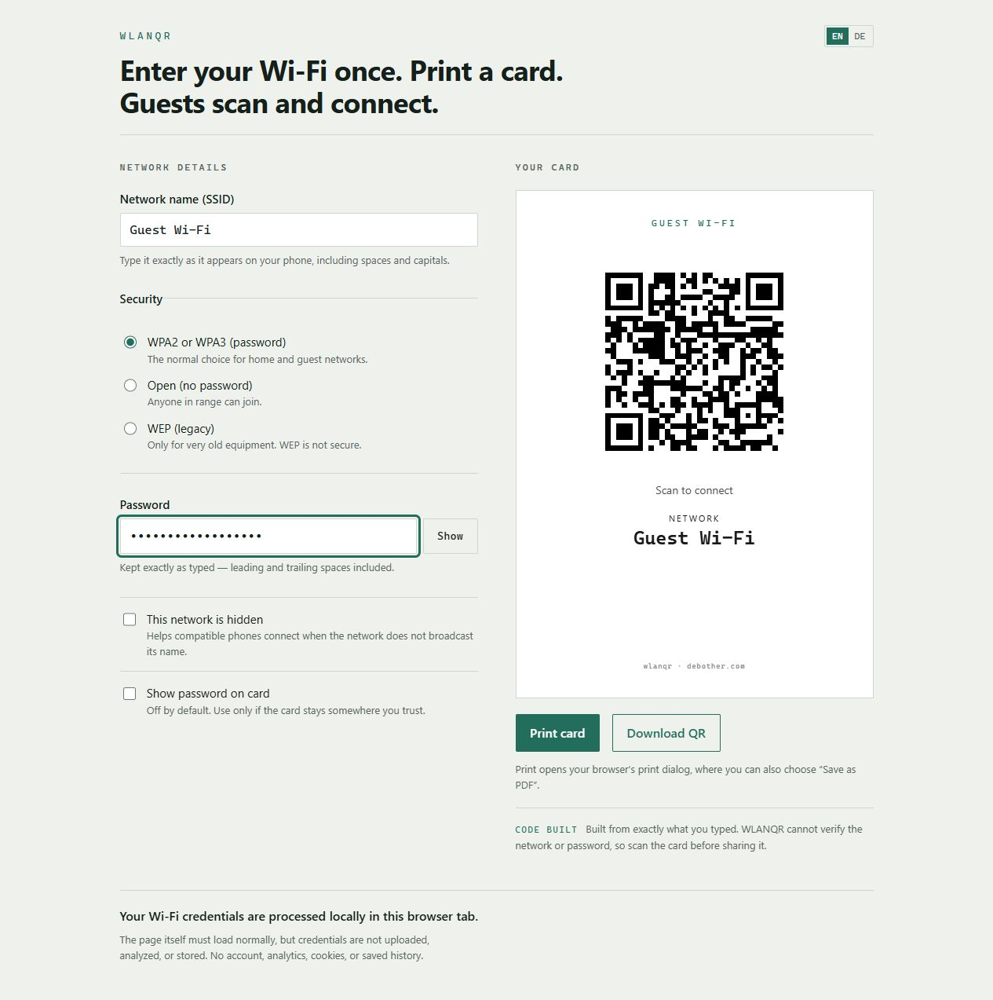

# WLANQR

Create a Wi-Fi QR card in seconds.

A tiny local-first utility for creating a printable guest Wi-Fi card without
uploading or storing your credentials.

**A Debother utility — small software for annoying problems.**



The preview uses synthetic example credentials only.

## What it does

Enter a network name, choose its security type, and add the password when
needed. WLANQR builds a scannable Wi-Fi QR code, a clean guest card for printing,
and a raw 1024 × 1024 PNG. The interface is available in English and German.

The optional plaintext password on the card is off by default. Pasted whitespace
is preserved exactly, with a small notice prompting you to verify it.

## Why WLANQR?

- **Private by design:** credentials stay in the browser.
- **Scan and connect:** create a familiar Wi-Fi QR code in seconds.
- **Ready to print:** produce one focused guest card using the browser's print
  dialog.
- **English & German:** switch languages directly in the interface.

## How it works

1. Enter the Wi-Fi details.
2. Scan the QR code or print the guest card.
3. Done.

## Privacy

Credentials are processed locally in the browser. They are not uploaded, stored
in browser storage, or sent to analytics. Closing the tab discards the entered
values.

WLANQR does not trim or normalize the SSID or password. It supports the common
`WIFI:` QR payload for WPA/WPA3-Personal, open, and legacy WEP networks;
enterprise Wi-Fi and captive-portal authentication are outside its scope.

## Development

Requirements: a current Node.js release and npm.

```bash
npm ci
npm run dev
```

Validation and production build:

```bash
npm test
npx tsc -b
npm run lint
npm run build
npm audit
```

The production build is written to `dist/`.

## Deployment

Railway builds the production assets in a pinned Node image and serves only
`dist/` from a pinned Caddy image. Set the non-secret `SITE_MODE` environment
value to exactly `production` for an indexable production deployment. Any
missing or different value defaults safely to staging behavior with
`X-Robots-Tag: noindex, nofollow` and `Cache-Control: no-store`.

## Validation

The feature-frozen V1 software baseline passes 64 automated tests, TypeScript,
lint, production build, dependency audit, bundle privacy checks, and independent
QR encode/decode tests.

Hardware acceptance is still pending:

- iPhone scan
- Android scan
- Browser print preview
- Physical print
- First-time human completion test

A generated QR code confirms payload construction, not that the entered
credentials are correct or that a particular device will join.

## Debother

WLANQR is a [Debother utility](https://debother.com).

Small software for annoying problems.
